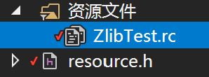
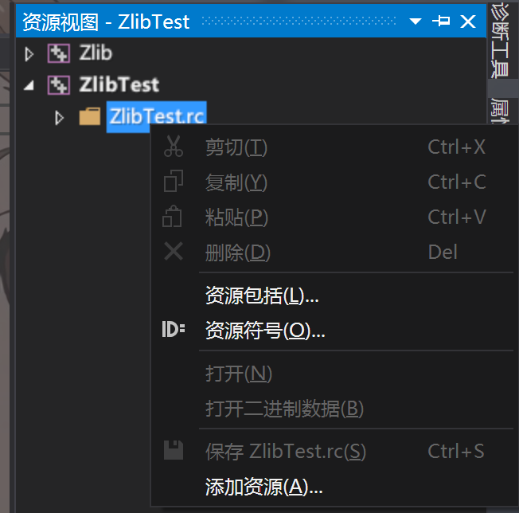
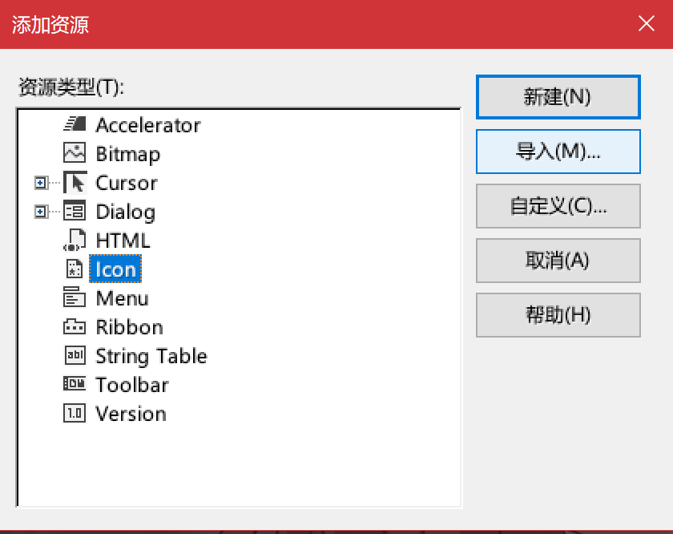

## 窗体图标的设置

图标的设置分为两部分

- 一是生成的可执行文件的图标
- 二是窗体运行时的图标

###   **第一种 - 可执行文件图标**

首先假设你已经准备好了图标文件([Icon](https://baike.baidu.com/item/ICON/32269?fr=aladdin))。

在**解决方案资源管理器**中找到"**资源文件**"项，右键**添加资源**。

注意第一次添加是没有资源文件的"xxx.rc"。

如有双击打开并右键**添加资源**，选择ICON文件，点击导入。

**选择Icon**点击**导入**，然后选择准备好的图标文件即可。

最后重新编译的效果是这样的。

### **第二种 - 运行时图标**

运行时图标一般通过代码进行设置。

有以下两个函数。

~~~c++
//该函数应该在ZWindow::Create()前调用
ZWindow::SetIcon(ZIcon);
//该函数应该在ZWindow::Create()后调用
ZWindow::SetIconEx(ZIcon);
~~~

ZIcon对象的初始化可以有两种。

- 从资源中加载

  ~~~c++
  ZIcon Icon;
  Icon = LoadIcon(GetModuleHandle(NULL), MAKEINTRESOURCE(IDI_ICON1));
  ~~~

- 从外部文件加载

  ~~~c++
  ZIcon Icon;
  Icon.LoadRes(L"xxx.ico");
  ~~~

[按钮的使用 - ZButton](按钮.md)