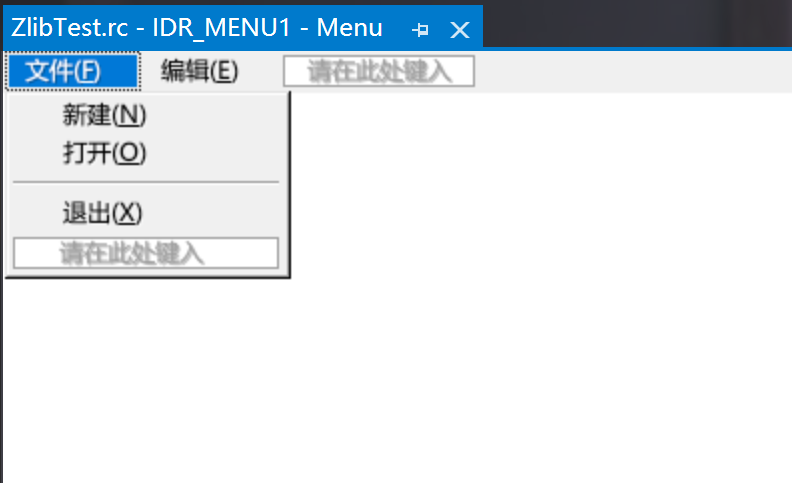

## 菜单 - ZMenu

### 普通菜单

**添加头文件和全局变量。**

~~~c++
#include "ZMenu.h"

ZMenu* Menu;
~~~

**从资源文件中添加菜单。**

- 新建资源文件

  在解决方法资源管理器中右键点击资源文件，点击添加资源。

  选择Menu，然后点新建。对菜单进行可视化编辑。

  

- 实例化菜单并加载资源，最后添加到窗体中。

  ~~~c++
  Menu = new ZMenu();
  *Menu = LoadMenu(NULL,MAKEINTRESOURCE(IDR_MENU1));
  Win->AddControl(Menu);
  ~~~

### 上下文菜单（右键菜单）

在上面的基础上，这里介绍上下文菜单。

上下文菜单的显示需要手动处理<kbd>WM_RBUTTONDOWN</kbd>消息。

~~~c++
LRESULT CALLBACK WndProc(HWND hWnd, UINT uMsg, WPARAM wParam, LPARAM lParam)
{
	switch (uMsg)
	{
	case WM_RBUTTONDOWN:
	{
		ZMenuItem temp = Menu->GetSubItem(0);
		temp.ShowPopupMenu(hWnd, LOWORD(lParam), HIWORD(lParam));
		break;
	}
    case WM_DESTROY:
		PostQuitMessage(0);
	default:
		break;
	}
	return DefWindowProc(hWnd, uMsg, wParam, lParam);
}
~~~

### 响应菜单的事件

参见 [ZButton](按钮.md) 响应的事件的方法，在<kbd>WM_COMMAND</kbd>中处理相应ID的消息。

[托盘 - ZNotify](托盘.md)