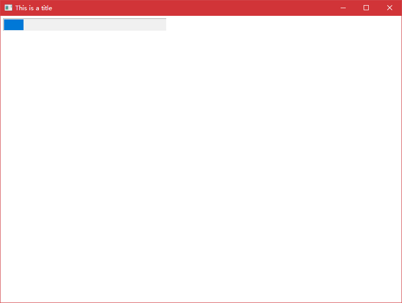

## 进度条 - ZProgressBar

### 创建进度条

- 添加头文件并创建全局变量

~~~c++
#include "ZProgressBar.h"

ZProgressBar* bar;
~~~

- 初始化 ZProgressBar 控件，并添加到窗体中。

~~~c++
bar = new ZProgressBar(5,5,320,25);
Win->AddControl(bar);
~~~

- 到此就完成了添加，值得注意的是控件的值区间默认为0~100。

### 多线程刷新进度条

- 先新自定义一个用于刷新进度的方法。

~~~c++
DWORD WINAPI Change(LPVOID)
{
	for (int i = 0; i < 100; i++)
	{
		bar->SetValue(i);
        //printf_s("%d\n", i);
		Sleep(1000);
	}
	return 0;
}
~~~

- 初始化时新建一个线程，用于执行刷新进度函数。

~~~c++
DWORD ID;
HANDLE hThread = CreateThread(NULL, 0, Change, (LPVOID)(0), 0, &ID);
~~~

[菜单 - ZMenu](菜单.md)